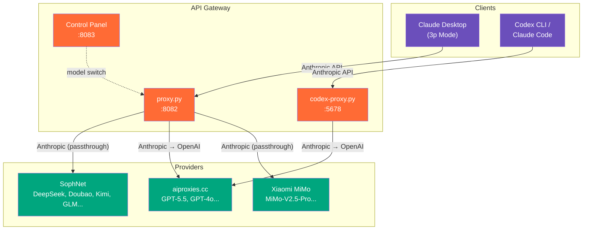
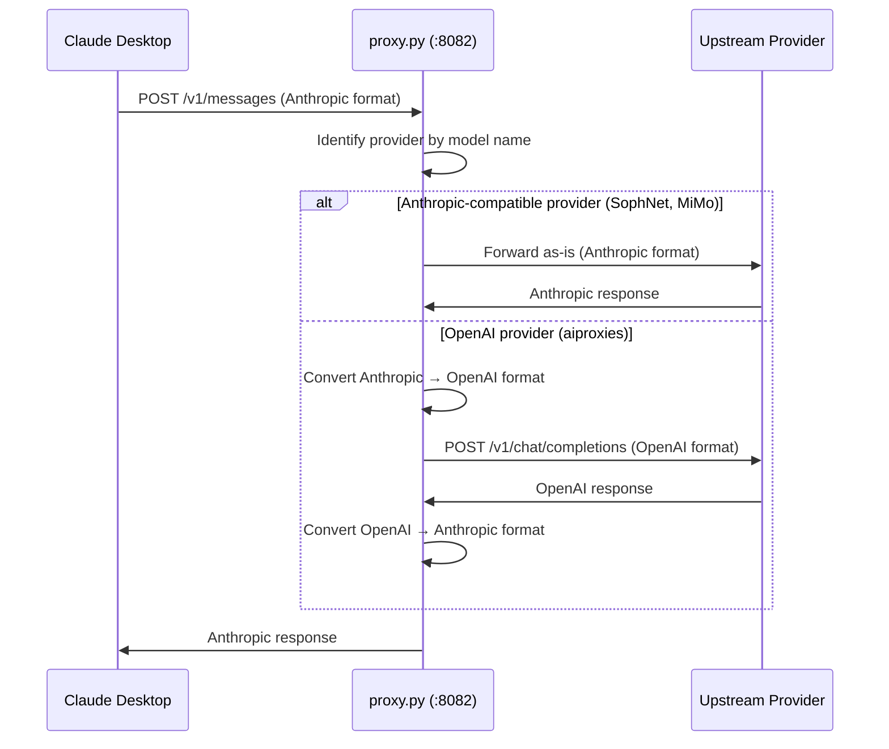
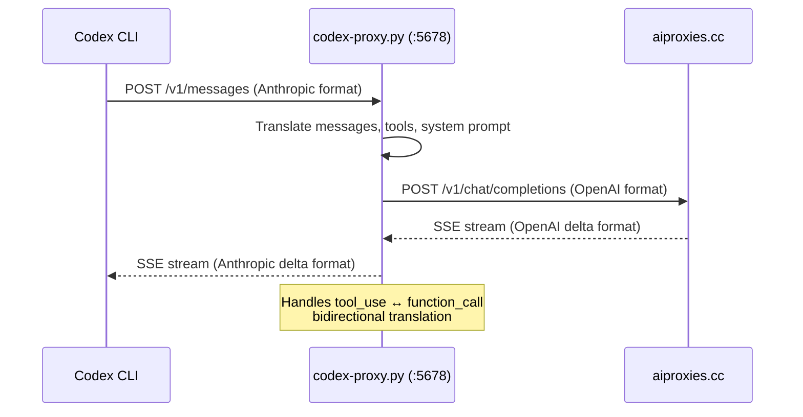

# API Gateway

[](LICENSE)
[](https://python.org)
[](https://flask.palletsprojects.com)
[](https://docs.aiohttp.org)

**Make Claude Desktop & Codex CLI work with any third-party model provider.**

Claude Desktop's 3p (third-party) mode and Codex CLI / Claude Code only connect to official APIs by default. This project provides a local proxy layer that enables **multi-provider routing + automatic protocol translation**, so you can freely use any third-party model in these tools.

[English](#architecture) | [中文](#中文说明)

---

## Architecture



## Features

- **Multi-Provider Gateway** — Route Claude Desktop to multiple model providers through a single proxy, with a browser-based control panel for instant model switching
- **Protocol Translation** — Bidirectional Anthropic <-> OpenAI format translation with full support for streaming and tool use
- **Image Input** — Automatically converts Anthropic image blocks to OpenAI `image_url` format
- **Image Generation** — Detects image generation requests and routes them to OpenAI Responses API (DALL-E)
- **Process Resilience** — Global exception handler + auto-restart loop ensures the proxy never crashes from upstream API errors
- **Centralized Key Management** — All API keys stored in `secrets.json` (gitignored), zero hardcoded credentials

## Supported Providers

| Provider | Models | Protocol | Notes |
|----------|--------|----------|-------|
| **SophNet** | DeepSeek-V4-Flash, DeepSeek-V4-Pro, GPT-4o-mini, Doubao-Seed-1.6, MiniMax, Kimi, GLM | Anthropic-compatible | Direct passthrough |
| **aiproxies.cc** | GPT-5.5, GPT-5.4, GPT-4o | OpenAI | Auto-translated to/from Anthropic format |
| **Xiaomi MiMo** | MiMo-V2.5-Pro, MiMo-V2.5, MiMo-V2-Pro | Anthropic-compatible | Direct passthrough |

> Adding a new provider takes ~20 lines of code. See [Adding New Providers](#adding-new-providers).

## Quick Start

### 1. Install dependencies

```bash
pip install -r requirements.txt
```

### 2. Configure API keys

```bash
cp secrets.example.json secrets.json
# Edit secrets.json with your actual API keys
```

<details>
<summary><b>secrets.json format</b></summary>

```json
{
  "aiproxies_key": "sk-your-aiproxies-key",
  "mimo_key": "sk-your-mimo-key",
  "qwen_key": "sk-your-qwen-key",
  "vectorengine_key": "sk-your-vectorengine-key"
}
```

</details>

### 3. Start the proxy

```bash
# Claude Desktop gateway (Proxy :8082 + Control Panel :8083)
python proxy.py

# Codex CLI protocol proxy (:5678)
python codex-proxy.py
```

### 4. Configure Claude Desktop

Create a 3p mode config file at `%LOCALAPPDATA%\Claude-3p\configLibrary\<uuid>.json`:

```json
{
  "inferenceProvider": "gateway",
  "inferenceGatewayBaseUrl": "http://127.0.0.1:8082",
  "inferenceGatewayApiKey": "<your-upstream-api-key>",
  "inferenceGatewayAuthScheme": "x-api-key"
}
```

Register available models in the Windows Registry:

```powershell
Set-ItemProperty -Path "HKCU:\SOFTWARE\Policies\Claude" -Name "inferenceModels" `
  -Value '["DeepSeek-V4-Flash","gpt-5.5","MiMo-V2.5-Pro"]' -Type String
```

### 5. Configure Codex CLI / Claude Code

```bash
export ANTHROPIC_BASE_URL=http://127.0.0.1:5678
export ANTHROPIC_API_KEY=sk-any-placeholder
codex  # or claude
```

Or use the endpoint switcher (PowerShell):

```powershell
. .\scripts\claude-switch.ps1 codex    # Local proxy → GPT-5.4
. .\scripts\claude-switch.ps1 qwen     # Self-hosted → Qwen
. .\scripts\claude-switch.ps1 vector   # VectorEngine → Claude
. .\scripts\claude-switch.ps1 list     # List all endpoints
```

## Project Structure

```
api-gateway/
├── proxy.py                  # Claude Desktop multi-provider gateway proxy
├── codex-proxy.py            # Codex CLI / Claude Code protocol translation proxy
├── requirements.txt          # Python dependencies
├── secrets.example.json      # API key template (safe to commit)
├── scripts/
│   ├── claude-switch.ps1     # Claude Code endpoint switcher
│   ├── proxy-loop.bat        # Auto-restart loop
│   └── start-proxy.vbs       # Windows silent startup (for Task Scheduler)
├── docs/
│   └── SKILL.md              # Tool description file
├── LICENSE
└── README.md
```

## How It Works

### proxy.py — Claude Desktop Gateway



### codex-proxy.py — Protocol Translation



## Control Panel

The gateway includes a built-in web control panel at `http://127.0.0.1:8083`:

- View the currently active model
- Switch models instantly (takes effect on the next message)
- Monitor request statistics and logs

## Adding New Providers

Adding a new model provider takes 5 steps:

**Step 1.** Add your API key to `secrets.json`:
```json
{ "new_provider_key": "sk-your-key" }
```

**Step 2.** Add constants at the top of `proxy.py`:
```python
NEW_PROVIDER_BASE = "https://api.newprovider.com/v1"
NEW_PROVIDER_KEY = _secrets.get("new_provider_key", "")
```

**Step 3.** Add model definitions and merge into `MODELS`:
```python
NEW_MODELS = {
    "new-model-name": {"provider": "newprovider", "upstream": "actual-model-id"},
}
MODELS = {**SOPHNET_MODELS, **AIPROXIES_MODELS, **MIMO_MODELS, **NEW_MODELS}
```

**Step 4.** Write a routing function. Copy the pattern that matches your provider's API:
- Anthropic-compatible? Copy `_proxy_via_mimo`
- OpenAI-compatible? Copy `_proxy_via_aiproxies`

**Step 5.** Add routing in `proxy_post()`:
```python
elif info["provider"] == "newprovider":
    return _proxy_via_newprovider(data, info["upstream"])
```

Restart the proxy and Claude Desktop. Done.

## Auto-Start on Windows

To start the proxy silently on boot:

1. Press `Win + R`, type `shell:startup`
2. Create a shortcut to `scripts/start-proxy.vbs`
3. The proxy will start silently in the background with auto-restart

---

## 中文说明

本项目解决的核心问题：**Claude Desktop 和 Codex CLI 默认只能连接官方 API，无法使用第三方模型**。

通过本地代理层，你可以：

- 在 Claude Desktop 中使用 DeepSeek、GPT-5.5、MiMo、Kimi、GLM 等任意模型
- 在 Codex CLI / Claude Code 中通过协议转换使用 OpenAI 兼容的模型
- 一键切换模型，无需重启应用
- 所有 API Key 集中管理，代码零硬编码

详细使用说明见上方英文文档，操作步骤完全一致。

## License

[MIT](LICENSE) - feel free to use, modify, and distribute.
