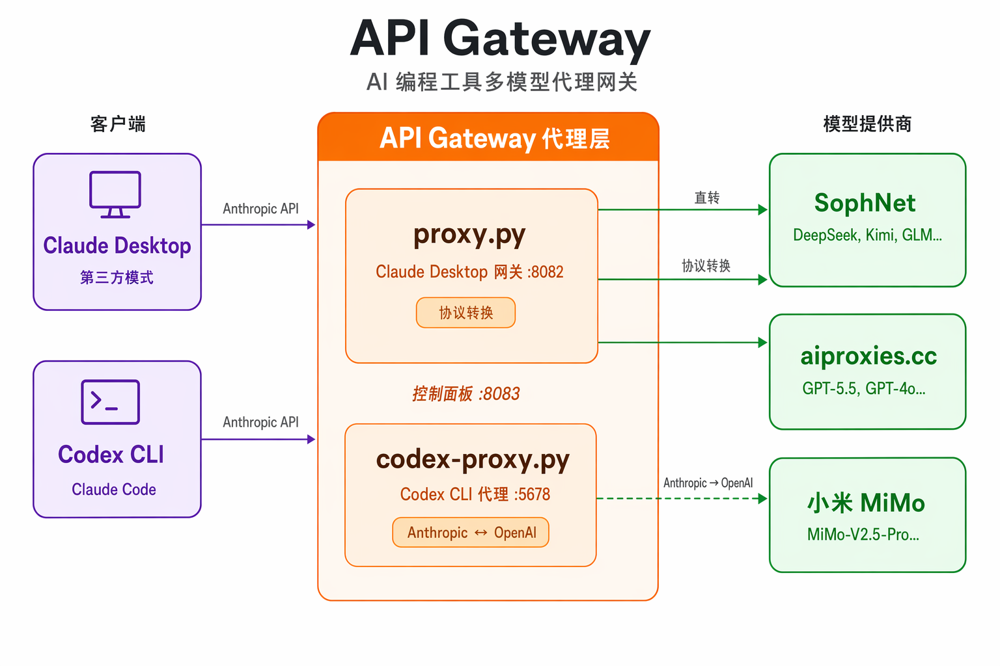
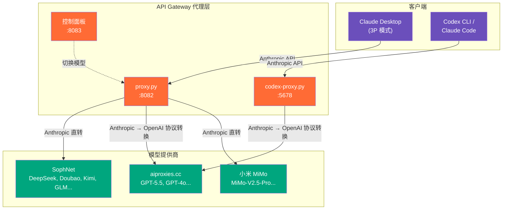
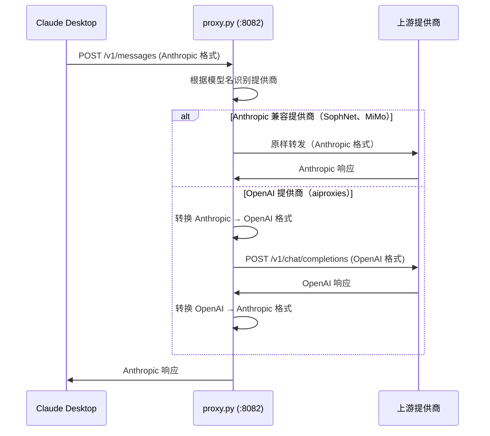
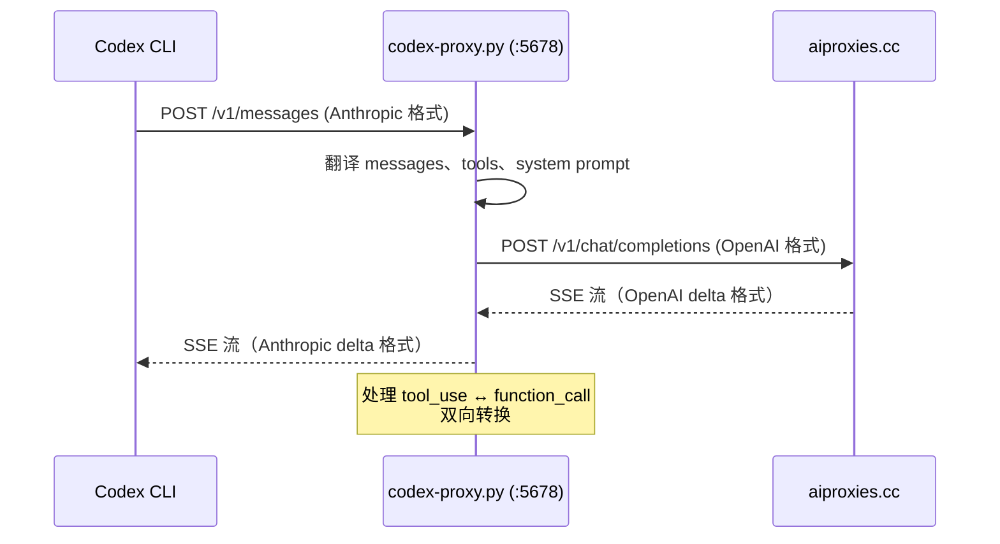

# API Gateway

<p align="center">
  
</p>

[](https://github.com/cheershuyang/api-gateway/actions)
[](LICENSE)
[](https://python.org)
[](#测试)
[](Dockerfile)
[](https://flask.palletsprojects.com)
[](https://docs.aiohttp.org)

**让 Claude Desktop 和 Codex CLI 接入任意第三方模型。**

Claude Desktop 的 3P（第三方）模式和 Codex CLI / Claude Code 默认只能连接官方 API。本项目提供本地代理层，实现**多提供商路由 + 协议自动转换**，让你在这些工具中自由使用各种第三方模型。

[中文](#为什么做这个项目) | [English](#english)

---

## 为什么做这个项目？

用官方 API 跑 AI 编程工具，有四个真实的痛点：

**贵** — Claude Sonnet 4 按量计费 $3/$15 每百万 token。连续编程一天（30-50 次重构）花 $11-19，**一个月 $300-500**。比很多地方雇初级开发还贵。

**买不了** — OpenAI 和 Anthropic 只收美国/欧洲信用卡。国内用户**根本没法直接付款**，不是不想买，是买不了。

**连不上** — `api.openai.com` 和 `api.anthropic.com` 在国内被墙。即使有 Key，不开代理也调不通。

**协议不通** — Claude Desktop 发的是 Anthropic Messages API 格式。你的中转站如果只支持 OpenAI Chat Completions 格式，就对不上——除非有东西在中间做翻译。

**本项目一次性解决以上所有问题。** 接入便宜的中转站/自建反代/国产模型，协议自动转换，一个代理搞定一切。

---

## 这些工具是什么？

### Claude Desktop

[Claude Desktop](https://claude.ai/download) 是 Anthropic 的桌面客户端。在 **3P（Third-Party）模式**下，它可以连接任意 API 端点而不是 Anthropic 官方服务器——这就是本网关的工作基础。

**安装配置：**
- 从 [claude.ai/download](https://claude.ai/download) 下载（Windows / macOS）
- 启用开发者模式：**Help → Troubleshooting → Enable Developer Mode**
- 配置 Gateway：**Developer → Configure Third-Party Inference**
- Gateway URL 必须用 `http://127.0.0.1:端口`，不能用 `localhost`

### Codex CLI

[Codex CLI](https://github.com/openai/codex) 是 OpenAI 开源的命令行编程 Agent。默认走 OpenAI API，通过 `codex-proxy.py` 可以接入任意提供商。

```bash
npm install -g @openai/codex
```

### Claude Code

[Claude Code](https://docs.anthropic.com/en/docs/claude-code) 是 Anthropic 的命令行编程助手。终端式 Agent，支持自主读写代码、执行命令、Sub-agent 并行。

```bash
npm install -g @anthropic-ai/claude-code
```

> 详细的踩坑指南（MSIX 路径 bug、注册表配置、Cowork VM 问题等）见 **[docs/troubleshooting.md](docs/troubleshooting.md)**

---

## 架构



## 功能特性

- **多提供商网关** — 一个代理接入多个模型提供商，浏览器控制面板一键切换模型
- **协议自动转换** — Anthropic ↔ OpenAI 格式双向翻译，完整支持流式输出和 Tool Use
- **图片输入** — 自动将 Anthropic 图片格式转为 OpenAI `image_url` 格式
- **AI 生图** — 检测生图请求自动路由到 OpenAI Responses API（DALL-E）
- **进程保活** — 全局异常捕获 + 自动重启循环，不会因为上游 API 报错而崩溃
- **密钥集中管理** — 所有 API Key 存储在 `secrets.json`（gitignored），代码零硬编码

## 支持的提供商

| 提供商 | 模型 | 协议 | 备注 |
|--------|------|------|------|
| **SophNet** | DeepSeek-V4-Flash, DeepSeek-V4-Pro, GPT-4o-mini, Doubao-Seed-1.6, MiniMax, Kimi, GLM | Anthropic 兼容 | 直接透传 |
| **aiproxies.cc** | GPT-5.5, GPT-5.4, GPT-4o | OpenAI | 自动协议转换 |
| **小米 MiMo** | MiMo-V2.5-Pro, MiMo-V2.5, MiMo-V2-Pro | Anthropic 兼容 | 直接透传 |

> 添加新提供商只需 ~20 行代码，见[添加新提供商](#添加新提供商)。

## 快速开始

### 1. 安装依赖

```bash
pip install -r requirements.txt
```

### 2. 配置密钥

```bash
cp secrets.example.json secrets.json
# 编辑 secrets.json，填入你的 API Key
```

<details>
<summary><b>secrets.json 格式</b></summary>

```json
{
  "aiproxies_key": "sk-你的aiproxies密钥",
  "mimo_key": "sk-你的mimo密钥",
  "qwen_key": "sk-你的qwen密钥",
  "vectorengine_key": "sk-你的vectorengine密钥"
}
```

</details>

### 3. 启动代理

```bash
# Claude Desktop 网关代理（代理 :8082 + 控制面板 :8083）
python proxy.py

# Codex CLI 协议转换代理（:5678）
python codex-proxy.py
```

### 4. 配置 Claude Desktop

在 `%LOCALAPPDATA%\Claude-3p\configLibrary\<uuid>.json` 创建 3P 模式配置文件：

```json
{
  "inferenceProvider": "gateway",
  "inferenceGatewayBaseUrl": "http://127.0.0.1:8082",
  "inferenceGatewayApiKey": "<你的上游API密钥>",
  "inferenceGatewayAuthScheme": "x-api-key"
}
```

在 Windows 注册表中注册可用模型：

```powershell
Set-ItemProperty -Path "HKCU:\SOFTWARE\Policies\Claude" -Name "inferenceModels" `
  -Value '["DeepSeek-V4-Flash","gpt-5.5","MiMo-V2.5-Pro"]' -Type String
```

### 5. 配置 Codex CLI / Claude Code

```bash
export ANTHROPIC_BASE_URL=http://127.0.0.1:5678
export ANTHROPIC_API_KEY=sk-any-placeholder
codex  # 或 claude
```

或使用端点切换器（PowerShell）：

```powershell
. .\scripts\claude-switch.ps1 codex    # 本地代理 → GPT-5.4
. .\scripts\claude-switch.ps1 qwen     # 自建反代 → Qwen
. .\scripts\claude-switch.ps1 vector   # VectorEngine → Claude
. .\scripts\claude-switch.ps1 list     # 列出所有端点
```

## 设计亮点

本项目的核心技术挑战在于 **Anthropic ↔ OpenAI 协议的实时双向翻译**，尤其是流式 SSE 事件流的状态机翻译。

### 流式 SSE 翻译状态机

OpenAI 的流式输出是扁平的 delta 序列，Anthropic 的流式输出是**结构化的事件流**（有 block 生命周期）。翻译器必须在流中实时判断"什么时候开始新 block、什么时候关闭旧 block"——不能等收完再处理：

```
OpenAI delta 流（扁平）           →    Anthropic 事件流（结构化）
─────────────────────                 ────────────────────────
                                      message_start
                                      content_block_start (text)
delta.content = "你"              →    content_block_delta (text_delta)
delta.content = "好"              →    content_block_delta (text_delta)
delta.tool_calls[0].id            →    content_block_stop ← 关闭文本块
                                      content_block_start (tool_use)
delta.tool_calls[0].args          →    content_block_delta (input_json_delta)
finish_reason = "tool_calls"      →    content_block_stop
                                      message_delta (stop_reason="tool_use")
[DONE]                            →    message_stop
```

### 工具调用双向映射

完整支持 AI Agent 的工具调用链路：`tool_use` ↔ `function_call` 双向转换，包括工具定义（`input_schema` ↔ `parameters`）、调用请求、结果返回三个环节。

### 双进程架构

两个代理进程独立运行、互不依赖。`proxy.py` 用 Flask（同步）因为 Claude Desktop 不并发；`codex-proxy.py` 用 aiohttp（异步）因为流式 SSE 翻译需要非阻塞 I/O。

> 完整的设计分析见 **[docs/architecture.md](docs/architecture.md)**

## 项目结构

```
api-gateway/
├── proxy.py                  # Claude Desktop 多提供商网关代理
├── codex-proxy.py            # Codex CLI / Claude Code 协议转换代理
├── requirements.txt          # Python 依赖
├── secrets.example.json      # 密钥模板（可安全提交）
├── Dockerfile                # 容器化部署
├── docker-compose.yml        # 多服务编排
├── tests/
│   └── test_translate.py     # 协议转换单元测试（20 cases）
├── scripts/
│   ├── claude-switch.ps1     # Claude Code 端点切换器
│   ├── proxy-loop.bat        # 自动重启循环
│   └── start-proxy.vbs       # Windows 静默启动
├── docs/
│   ├── architecture.md       # 架构设计文档（协议差异分析 + 状态机）
│   ├── troubleshooting.md    # 踩坑指南（12+ 个坑）
│   └── api-gateway-banner.png
├── .github/workflows/ci.yml  # GitHub Actions（lint + test）
├── CONTRIBUTING.md           # 贡献指南
├── CHANGELOG.md              # 版本变更记录
├── LICENSE
└── README.md
```

## 工作原理

### proxy.py — Claude Desktop 网关



### codex-proxy.py — 协议转换



## 控制面板

启动后打开 `http://127.0.0.1:8083`：

- 查看当前选中的模型
- 一键切换模型（下一条消息立即生效）
- 查看请求统计和日志

## 添加新提供商

添加新模型提供商只需 5 步：

**第 1 步** — 在 `secrets.json` 中添加 API Key：
```json
{ "new_provider_key": "sk-你的密钥" }
```

**第 2 步** — 在 `proxy.py` 顶部添加常量：
```python
NEW_PROVIDER_BASE = "https://api.newprovider.com/v1"
NEW_PROVIDER_KEY = _secrets.get("new_provider_key", "")
```

**第 3 步** — 添加模型字典并合并到 `MODELS`：
```python
NEW_MODELS = {
    "new-model-name": {"provider": "newprovider", "upstream": "actual-model-id"},
}
MODELS = {**SOPHNET_MODELS, **AIPROXIES_MODELS, **MIMO_MODELS, **NEW_MODELS}
```

**第 4 步** — 写路由函数。复制与你的提供商 API 格式匹配的模板：
- Anthropic 兼容？复制 `_proxy_via_mimo`
- OpenAI 兼容？复制 `_proxy_via_aiproxies`

**第 5 步** — 在 `proxy_post()` 中添加路由判断：
```python
elif info["provider"] == "newprovider":
    return _proxy_via_newprovider(data, info["upstream"])
```

重启代理和 Claude Desktop，完成。

## Windows 开机自启

静默后台启动，开机自动运行：

1. `Win + R` 输入 `shell:startup`
2. 创建 `scripts/start-proxy.vbs` 的快捷方式放进去
3. 代理将在后台静默运行，带自动重启

## 测试

```bash
# 运行全部测试
python -m pytest tests/ -v

# Lint 检查
ruff check . --select E,F,W --ignore E501
```

测试覆盖：
- **请求翻译**（8 cases）：system prompt、消息格式、工具定义、tool_use/tool_result、流式选项
- **响应翻译**（5 cases）：文本、工具调用、混合内容、停止原因映射、畸形参数容错
- **辅助函数**（7 cases）：消息构建、图片格式转换、生图请求检测

## Docker 部署

```bash
# 使用 docker-compose 启动所有服务
docker-compose up -d

# 或单独构建运行
docker build -t api-gateway .
docker run -d -p 8082:8082 -p 8083:8083 -v ./secrets.json:/app/secrets.json:ro api-gateway
```

## 踩坑指南

我们整理了 **12+ 个**配置过程中遇到的坑和修复方案：

- MSIX 路径虚拟化 bug（VM 沙箱、MCP 配置文件）
- 注册表配置参考（Gateway、Cowork、MCP）
- 模型名显示异常、模型列表不更新
- Proxy 崩溃恢复、环境变量持久化
- Clash 代理冲突、curl 不走系统代理

详见 **[docs/troubleshooting.md](docs/troubleshooting.md)**

---

<details>
<summary><h2>English</h2></summary>

**Make Claude Desktop & Codex CLI work with any third-party model provider.**

Claude Desktop's 3P mode and Codex CLI / Claude Code only connect to official APIs by default. This project provides a local proxy layer that enables multi-provider routing + automatic protocol translation.

### Why?

- **Cost**: Official API pricing ($300-500/month for heavy use) is prohibitive
- **Payment**: OpenAI/Anthropic only accept US/EU credit cards
- **Network**: API endpoints are blocked in some regions
- **Protocol**: Claude Desktop speaks Anthropic format; your provider might only support OpenAI format

### Features

- Multi-provider gateway with browser control panel for instant model switching
- Bidirectional Anthropic <-> OpenAI protocol translation (streaming + tool use)
- Image input format conversion + DALL-E image generation routing
- Global exception handler + auto-restart loop
- Centralized key management via `secrets.json` (gitignored)

### Quick Start

```bash
pip install -r requirements.txt
cp secrets.example.json secrets.json  # fill in your API keys
python proxy.py                       # Claude Desktop gateway (:8082 + :8083)
python codex-proxy.py                 # Codex CLI proxy (:5678)
```

For full setup instructions, see the Chinese documentation above. All configuration steps are identical.

For troubleshooting (MSIX bugs, registry config, etc.), see **[docs/troubleshooting.md](docs/troubleshooting.md)**

</details>

## License

[MIT](LICENSE)
